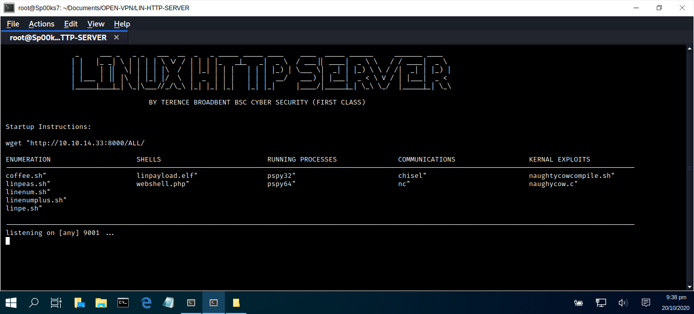

# LIN-HTTP-SERVER

A custom shell-script file that downloads varies exploitation files and manages a simple Linux HTTP Server.

TESTED: Kali Linux 2019  
USAGE : sh linux.sh

| SCRIPT | FILENAME    | INFORMATION                   | MD5 Hash                         | Version |
|------  |------       | -------                       | ----                             | ----   |
| sh     | install.sh  | Installs all necessary files. | 96a81b071c38791d8107b7bf8ac38fba | abc123 |
| sh     | linux.sh    | Manages HTTP server profiles. | 656e75810eabe93b0af0d594e8cf243d | abc123 |
| sh     | tidyup.sh   | Tidy's up redundent files.    | ffee0a123fca1102942fef293ec6c849 | abc123 | 

## COMPUTER MISUSE ACT 1990 - SECTION 3A
This software program has been specifically written for the purpose of legitimate penetration testing and should not be used for any other unauthorised or nefarious reasons.

### CONSOLE DISPLAY

